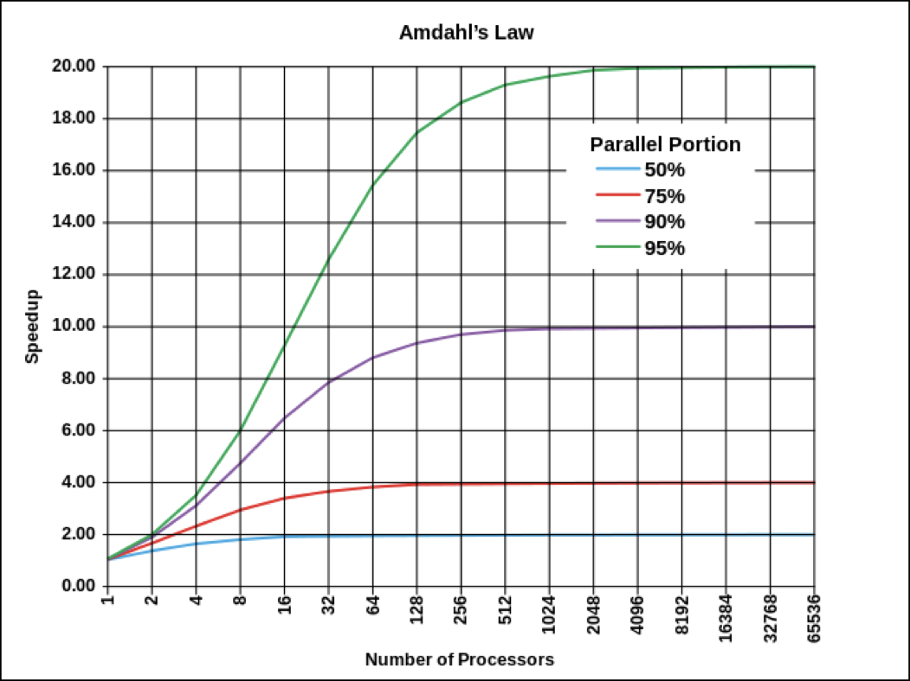
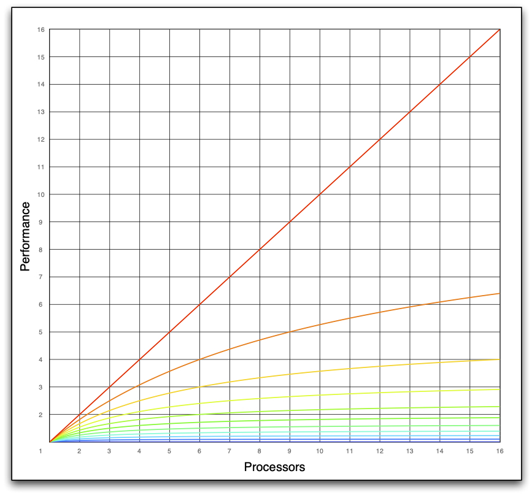

### Motivation

_Concurrency_ is when multiple tasks start, run, and complete in overlapping time periods and should not be confused with _parallelism_ which is when multiple tasks execute simultaneously. Parallelism requires some form of hardware support, where as concurrency can be achieved strictly through software, such as a cooperative tasking system.

There are two primary benefits for concurrent code. The first is performance by enabling parallelism. The second is to improve interactivity by not blocking the user while a prior action is being processed.

As clock rates on systems have stagnated, hardware developers have turned to parallelism to increase performance. Figure [xxx] shows the performance distribution on a typical desktop system. A single threaded, non-vectorized, application can only utilize about 0.25% of the performance capabilities of the machine.

The goal of this chapter is to develop concurrent code without using raw synchronization primitives.

### Definition of _raw synchronization primitives_

A _raw synchronization primitive_ is a low level construct used to synchronize access to data. Examples include locks and mutexes, condition variables, semaphores, atomic operations and memory fences.

{::comment} Discuss difference between data parallelism and task concurrency, so far this chapter is only dealing with tasking. However, it could be expanded upon. {:/comment}

### Problems of _raw synchronization primitives_

The first problem with raw synchronization primitives are that they are exceedingly error prone to use because, by definition, they require reasoning about non-local effects.

For example, the following is a snippet from a copy-on-write[^cow_definition] data type, this is a simplified version of code from a shipping system. 



The code contains a subtle race condition. The `if` statement at line 16 is checking the value of an atomic count to see if it is 1. The `else` statement handles the case where it is not 1. Within the else statement the count is decremented at line 19. The problem is that if decrementing the count results in a value of 0 then the object stored in `_object` should be deleted. The code fails to check for this case, and so an object may be leaked.

The initial test to see if the count was 1 isn't sufficient, between that check and when the count is decremented another thread may have released ownership and decremented the count leaving this object instance as the sole owner.

The fix is to test atomically with the decrement in the same statement, line 19. The correct code is shown in shown below:



The code of the complete, correct implementations is available online[^cow]

Another problem with raw synchronization primitives is that their use can have a large negative impact on system performance. To understand why, we need to understand Amdahl's Law.

The intuition behind Amdahl's Law is that if a part of system takes time x to complete on a single core or processor, then it will encounter a speedup of y if it is run on y cores, but only if no synchronization takes places between the different cores or processors. 

$$S(N) = \frac{1}{(1-P)+\frac{P}{N}}$$
Where the speedup $$S$$ is defined by this equation. $$P$$ is hereby the amount of synchronization in the range of $$[0 .. 1]$$ and $$N$$ the number of cores or processors.

Drawing the abscissa in logarithmic scale illustrates that there is only a speedup of 20 times, even when the system is running on 2048 cores or more and just 5% synchronization takes place.

{::comment} Convert/Create new SVG image

{::/comment}

{:height="40%" width="40%"}
Amdahl's Law Logarithmic Scale

Since most desktop or mobile processors have less than 64 cores, it is better to take a look at the graph with linear scale. Each line below the diagonal represents 10% more of serialisation. So if the application just have 10% of serialisation and it is running on 16 cores then there is only a speed-up just a little better than factor of six.

{::comment} Convert/Create new SVG image

{::/comment}
{:height="40%" width="40%"}
Amdahl's Law Linear Scale

So Amdahl's law has a huge impact. Serialization doesn't mean only locking on a mutex. Serialization can mean sharing the same memory or sharing the same address bus for the memory, if it is not a NUMA architecture. Sharing the same cache line or anything that is shared within the processor starts to bend that curve down and it bends down rapidly, even an atomic bends that curve down.

An often used model for implementing exclusive access to an object by multiple threads is this:



As long as one thread has exclusive access to the object all other threads have to wait until they get the access right. 

This is a horrible horrible way to think about threading. The goal has to be to minimize waiting at all costs. David Butenhof, one of the POSIX implementors, coined the phrase that mutex should be better named bottleneck, because of the property of slowing down an application[^butenhof]

In the following, let's take a look at a traditional piece of code:



It is a registry class with a shared `set` and `get` function. The access to the underlying unordered map is protected against concurrent access with a mutex. At the first glance it seems that only minimal work is done under the mutex. The unordered map is a fairly efficient data structure, it is a hash map. But the amount of time it takes to hash the key depends on the length of the string. So the work that is being done under the lock here is actually fairly unbounded. It depends completely on the lengths of the string. It may be probably typically small but it could be big. On top of the hash calculation comes a potentially allocation of a new bucket within the unordered map, which in most cases requires another lock within the memory manager. This lock can be, depending on the operating system, a global lock within the process.

For a better understanding what shall be actually achieved by using the locks it is necessary to take step back. The C++ standard states here: _It can be shown that programs that correctly use mutexes and memory\_order\_seq\_cst operations to prevent all data races and use no other synchronization operations behave as if the operations executed by their constituent threads were simply interleaved, with each value computation of an object being taken from the last side effect on that object in that interleaving. This is normally referred to as ‘sequential consistency.’_, C++11 Standard 1.10.21.

So why is this an important sentence? It means that one can always think about mutexes as if one has some set of interleaved operations. 



* A mutex serializes a set of operations, $$Op_n$$, where the operation is the code executed while the mutex is locked
* Operations are interleaved and may be executed in any order and may be repeated
* Each operation takes an argument, $$x$$, which is the set of all objects mutated under all operations
  * $$x$$ may not be safely read or written without holding the lock if it may be modified by a task holding the lock
* Each operation may yield a result, $$r_m$$, which can communicate information about the state of $$x$$ while it’s associated operation was executed
* The same is true of all atomic operations

The same is true of all atomic operations. So there is not a lot of difference between an `std::atomic`. In fact there is a call on `std::atomic` that returns `true`, if it is lock free. This means the processor supports to do that as an atomic item within the processor or is there not processor support and the compiler has to generate a mutex pair to lock, make the change on the atomic operation, and do the unlock. So all that mutexes and locks are the way to construct atomic operations. 

That means that any piece of code that has a mutex can be transformed into a queued model. This idea applied to the registry example from above leads to this:



Given that there is a serial queue `_q` with an `async` function which executes the passed item and it uses the same calling conventions as `std::async`. Hereby with the difference that it guarantees that that the next item being processed in that queue doesn't start until the previous one is completed. Then one can rewrite the `set` string function to be executed with `_q.async`.
As well one can rewrite the `get` string operation. But the difference is, that one needs the result back out, paired with that particular `get`. It is realized here with a future. (Futures will be covered later in more detail.) So the result of the `get` function, e.g. with a continuation, can be used whenever the `key` is hashed and and the lookup in the hash is completed.



Why is this important to understand? Because any place I have a mutex in my code I can always make this transformation. I can always transform it into a serialized queue model. And that means that within the serialized queue model now anytime somebody comes along and says `set`, regardless of the amount of work that `set` takes, the time it takes for `set` to return back to the caller is constant. So that means that I can add something like `set` an arbitrary set of value the whole vector of key value pairs. And to the caller that `set` will take just as much time as the previous `set` it's an on block so this puts an upper bound now there's overhead in this right I've got to queue an item. I've got to de-queue the item I've got to deal with futures if I've got results coming in if I'm calling this set as opposed to calling just set string set sync set string

### Motivation

1st example export from ui with compression and possibility to cancel
2nd example export group of images with compression and possibility to cancel

### Develop Solution

1st solution Use futures 
2nd solution Use channels

### Conclusion

[^cow_definition]:
    Copy-on-write [https://en.wikipedia.org/wiki/Copy-on-write](https://en.wikipedia.org/wiki/Copy-on-write)

[^cow]:
    Copy-on-write implementation in stlab. [https://github.com/stlab/libraries/blob/develop/stlab/copy_on_write.hpp](https://github.com/stlab/libraries/blob/develop/stlab/copy_on_write.hpp)

[^butenhof]:
    Recursive mutexes by David Butenhof [http://zaval.org/resources/library/butenhof1.html](Recursive mutexes by David Butenhof)